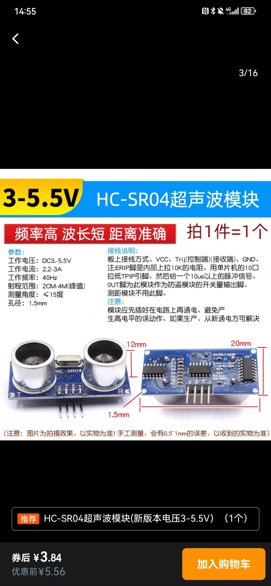

# pi5-ultrasonic-tools

Pi5的超声波传感器使用示例，代码基于 `gpiozero` 库实现。



## 接线

```
VCC  → Pi 5V (pin 2)
GND  → Pi GND
TRIG → BCM23 (pin 16)
ECHO → BCM24 (pin 18) 请使用 3.3V 电平转换
```

## 依赖

```bash
pip install gpiozero lgpio
```

代码中已显式指定 `lgpio` 作为 GPIO 后端，因此无需额外设置环境变量。

## 示例

仓库包含 `ultrasonic_device.py` 类和 `main.py` 示例，可用于在树莓派5上读取 HC-SR04 超声波传感器的距离数据。通过命令行参数可设置检测周期和针脚。
### 运行方式

```bash
python3 main.py --interval 1 --trig 23 --echo 24 --max-dist 2.0
```

终端会按指定间隔打印测定的距离。

### 参数说明

- `-i/--interval` 测量间隔（秒），默认1.0
- `--trig` TRIG 针脚（BCM），默认23
- `--echo` ECHO 针脚（BCM），默认24
- `--max-dist` 最大测量距离（米），默认2.0
